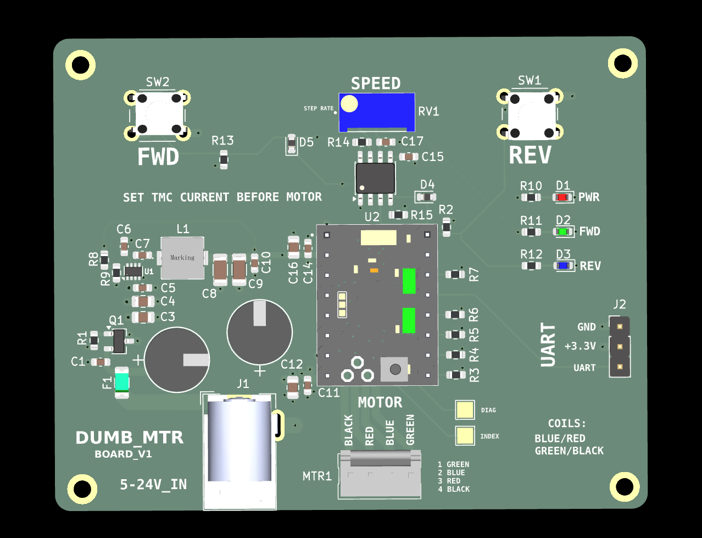
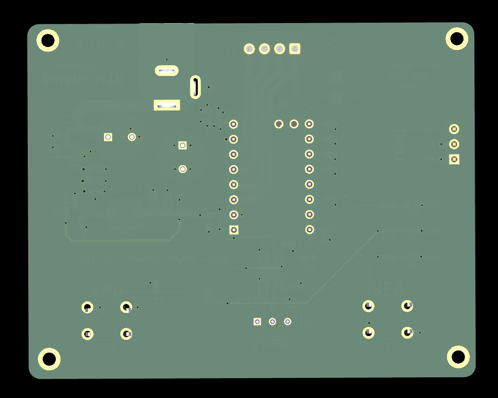

# DUMB_MTR_BOARD

<p align="center">
  
</p>

<p align="center">
  
</p>

Standalone stepper motor controller board with local forward/reverse jog buttons, speed adjustment, status LEDs, and a TMC stepper driver module.

Motor controller board

DUMB_MTR Board provides a small standalone interface for driving a stepper motor.

Core functions:

* Power input from 5-24V
* Stepper motor output connector
* Forward and reverse jog buttons
* Speed adjustment potentiometer
* RGB/status LEDs
* UART header for driver configuration/debugging
* Manual local control without needing the Brain_Board

Input power:     5-24V
Motor driver:    TMC stepper driver module
Controls:        FWD / REV buttons
Adjustment:      Speed potentiometer
Indicators:      Power / direction LEDs
Motor output:    4-pin stepper connector
Logic rail:      On-board 3.3V regulator


# DUMB_MTR Board

A compact standalone stepper motor control board built around a TMC stepper driver module.

This board is designed as a simple hands-on motor controller with local direction controls, speed adjustment, motor output, status LEDs, and a selectable input power source.

## System Role

```text
5-24V input power
        ↓
DUMB_MTR_BOARD
        ↓ local FWD / REV buttons + speed potentiometer
TMC stepper driver module
        ↓
4-wire stepper motor
```

DUMB_MTR_BOARD is the controller and driver carrier for a simple local stepper motor setup.

## Key Specs

| Item | Value |
|---|---|
| Board role | Standalone stepper motor controller |
| Input power | 5-24V |
| Motor driver | TMC stepper driver module |
| Motor output | 4-pin stepper connector |
| Local controls | Forward / reverse jog buttons |
| Adjustment | Speed potentiometer |
| Indicators | Power / direction / status LEDs |
| Debug/config | UART header |
| Logic rail | On-board 3.3V regulator |
| Main use | Manual motor control and driver testing |

## Main Features

- 5-24V input power
- TMC stepper driver module footprint/header
- 4-pin stepper motor output connector
- Forward jog button
- Reverse jog button
- Speed adjustment potentiometer
- RGB/status LED indicators
- UART header for driver configuration/debugging
- On-board 3.3V logic regulation
- Manual local motor control without BRAIN_BOARD
- Compact bench-testable layout

## Controls

### Forward / Reverse Jog

The board includes local direction/jog buttons for manual control.

```text
FWD button → forward jog command
REV button → reverse jog command
```

### Speed Potentiometer

The speed potentiometer provides a local analog adjustment for motor speed or step timing.

```text
Potentiometer → speed / rate control input
```

Firmware or local control logic should map the potentiometer reading into an appropriate step rate.

## Motor Driver

The board is built around a TMC stepper driver module.

Typical driver-side signals may include:

| Signal | Purpose |
|---|---|
| STEP | Step pulse input |
| DIR | Direction input |
| EN | Driver enable |
| UART | Driver configuration/debugging |
| VM | Motor supply input |
| GND | Shared ground |
| A1/A2/B1/B2 | Stepper coil outputs |

Confirm the exact TMC module pinout before installing a driver module.

## Power Architecture

```text
5-24V input
    ↓
motor-driver VM rail
    ↓
TMC stepper driver module
    ↓
motor phase outputs
```

Logic power is generated locally:

```text
input power → 3.3V regulator → local logic/control rail
```

## Motor Output

The motor output is a 4-pin connector for a bipolar stepper motor.

Typical coil mapping:

```text
Coil A → A1 / A2
Coil B → B1 / B2
```

Always verify motor coil pairs with a meter before connecting the motor.

## UART Header

The UART header is intended for TMC driver configuration, tuning, or debug access.

```text
UART TX/RX
GND
logic reference
```

Match voltage levels before connecting any external USB-to-UART adapter.

## Design Notes

- Keep motor-current paths short and wide.
- Keep motor VM routing away from low-level control signals where practical.
- Verify the TMC driver module orientation before power-up.
- Confirm the potentiometer direction and firmware mapping during bring-up.
- Start with current-limited input power during first tests.
- Do not hot-plug the stepper motor while the driver is powered.
- Keep UART/debug access available for driver tuning.

## Bring-Up Checklist

1. Inspect soldering and connector orientation.
2. Confirm no short between input power and GND.
3. Confirm no short between 3.3V and GND.
4. Power the board with a current-limited supply.
5. Verify the 3.3V rail.
6. Confirm power/status LEDs behave as expected.
7. Verify the TMC driver module orientation.
8. Connect UART/debug if driver configuration is needed.
9. Confirm FWD and REV buttons are read correctly.
10. Confirm the speed potentiometer changes the command rate.
11. Connect the motor after verifying coil pairs.
12. Start with low current and slow speed before full operation.

## Repository Output Images

Expected image paths for GitHub README rendering:

```text
Outputs/
  IMG/
    3D-T.png
    3D-B.png
    SCHEMATIC.png
    L1-SIG.png
    L2-GND.png
```

## Safety / Design Note

DUMB_MTR_BOARD handles motor power. Verify input polarity, motor wiring, driver orientation, current settings, and thermal behavior before running the motor under load.

Designed & engineered by Brandon Shelly


